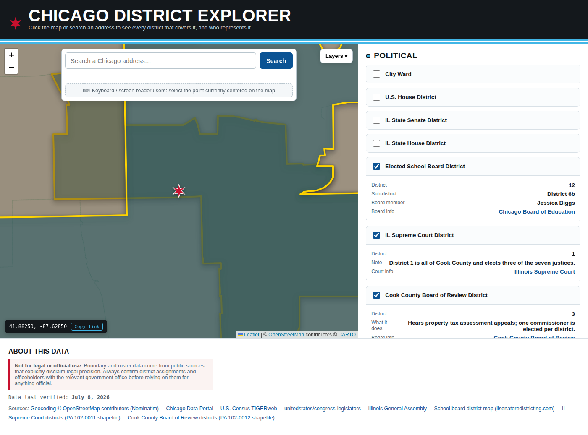

<!-- ==== GENERATED:BEGIN metro-header ==== -->
# Chicago District Explorer

**Click any point in Chicago — or search an address — and see every civic district that contains it, and who represents you there.**
<!-- ==== GENERATED:END metro-header ==== -->

A single-file, dependency-light web app: one `index.html`, Leaflet for the map, no build step, no framework, no server-side code. Deployed as a static site to [chidistricts.com](https://chidistricts.com/) — any static host or server works.



This is the reference implementation of a small fleet of sibling metro forks ([nyc.chidistricts.com](https://nyc.chidistricts.com/), [sf.chidistricts.com](https://sf.chidistricts.com/)). The metro-agnostic engine inside `index.html` stays byte-identical across forks; everything city-specific lives in `metro-worksheet.json` and the `METRO:BEGIN config` block. The fleet-wide layer inventory is [`docs/DATA_LAYER_GUIDEBOOK.md`](docs/DATA_LAYER_GUIDEBOOK.md).

## What it answers

Pick a point. The app runs a point-in-district lookup across every layer you have toggled on and builds a "civic profile" for that location. 36 layers ship today; layers are location-aware, so city-only layers hide outside Chicago, the two Cook layers hide outside Cook County, the five Will County layers appear only inside Will County, and the statewide layers work anywhere in Illinois.

| Group | Layer | What you get |
|---|---|---|
| **Political** | City Ward | Ward number, alderman, office phone + address |
| | Ward Precinct | Precinct number (a sub-selection of City Ward — turning it on drops the ward to an outline and fills it with its precincts) |
| | Cook County Commissioner District | District number, commissioner, office address |
| | U.S. House District | District (IL-N), representative, party, D.C. phone, website |
| | IL State Senate District | Senator, party, Springfield + district offices, ILGA page |
| | IL State House District | State representative, party, offices, ILGA page |
| | Elected School Board District | ERSB district + "6b"-style sub-district, elected board member |
| | IL Supreme Court District | District under PA 102-0011 (District 1 = Cook County) |
| | Cook County Board of Review District | District under PA 102-0012 (property-tax appeals) |
| | Early Voting Site (nearest 3) | Official early-voting sites for the current cycle — site, ward, address, distance (hand-curated per election from chicagoelections.gov; each site also hosts a secured ballot drop box) |
| | Judicial Subcircuit (Will) | 12th-Circuit judicial subcircuit, for points in Will County |
| | Will County Board District | Board district + the elected members for it (roster rebuilt weekly by CI) |
| **Public Safety** | Police District | CPD district number and name, commander, CAPS unit phone/email, station address + phone, district map link |
| | Police Beat | Beat number (a sub-selection of Police District — turning it on drops the district to an outline and fills it with its beats) |
| | CCPSA District Council | The three elected District Councilors for that police district (name + role) and links to each Councilor's profile + the council page |
| | Police Station (nearest 3) | Station name, address, phone, straight-line distance |
| | Fire Station (nearest 3) | Firehouse + engine designation, distance |
| | Fire Protection District (Will) | Suburban fire *protection* (taxing) district + trustees, for points in Will County |
| **Schools** | Elementary / Middle / High School Zone | CPS attendance-boundary school, grades, address, profile link, map pin |
| | CPS Network (K-8 / High School) | Network, chief, phone, office address |
| | School District (Unified / Elementary / High School) | Statewide TIGERweb school-district identity — which district a point belongs to anywhere in Illinois |
| | School Location (nearest 3) | Nearest schools — name, grades, type, address, distance |
| **Geography** | Community Area | Official community area name + number |
| | ZIP Code | ZIP code (live Census TIGERweb ZCTA — works statewide) |
| | County | County name + seal, anywhere in Illinois |
| | Township / County Subdivision | Township (a sub-selection of County) |
| | Municipality | Incorporated place name, anywhere in Illinois |
| | Park District (Will) | Park district + commissioners, for points in Will County |
| | Voting Precinct (Will) | Will County voting precinct (a sub-selection of Township) |
| | Post Office (nearest 3) | Post office name, address, distance (USGS National Map structures) |
| | Library (nearest 3) | Chicago Public Library location, address, phone, distance |

Every result card is independent: a layer whose data source is down shows an error with a Retry button in that card and never affects the others.

### Shareable links

The URL hash mirrors your current view (`#point=41.88250,-87.62850&layers=ward,school-board`). Copy it from the URL bar — or use the **Copy link** button on the selected-point chip — and anyone opening the link sees the same point with the same layers on.

## Running it

There is nothing to build.

```bash
# any static server works:
python3 -m http.server 8000
# then open http://localhost:8000/
```

Most layers fetch live data from public APIs at runtime, so they need an internet connection. Layers with no public API ship same-origin files under `data/app/` that the page fetches on first toggle: the Elected School Board, IL Supreme Court, and Board of Review boundaries; the pre-built U.S. House / IL Senate / IL House district geometry; the Will County outline used for coverage tests; and the hand-curated early-voting site list. With the service worker installed the boundary files are cached (cache-first), so once a layer has loaded it keeps working offline; the officeholder rosters and the early-voting list are cached network-first so a returning visitor always gets the latest.

## Architecture

Stable core + pluggable layer modules, all inside `index.html`. The full contract and build history live in [`docs/BUILD_PLAYBOOK_1.md`](docs/BUILD_PLAYBOOK_1.md); the metro-port recipe is [`docs/METRO_EXPANSION_PLAYBOOK.md`](docs/METRO_EXPANSION_PLAYBOOK.md).

- **Core**: Leaflet map, click-to-select + Photon/Nominatim geocoder (debounced, Chicago-bounded), global `{selectedPoint, sequence}` state where a monotonic sequence counter discards stale async results, shared `sanitize` / `pointInGeometry` / `fetchJSONWithRetry` utilities, layer registry + result-card framework with per-layer failure isolation, selected-boundary highlight, URL-hash permalinks.
- **Modules**: each layer registers `{id, group, label, overlay:{load, style}, query(point, seq), render(result)}`. Overlays lazy-load on first toggle and are cached; `query` runs a local point-in-polygon test against the cached boundaries (or nearest-N haversine for station/school/amenity layers). Layers can declare a `coverage(point)` test — outside their coverage they hide instead of erroring.
- **Result cards**: cards open with the layer name, then the district identifier, then — wherever a verifiable source exists — the officeholder(s), office location, contact info, and a link to more detail, in that order. Layers whose concept has no representative (a ZIP, a community area) omit the roster rows rather than padding them.
- **Honesty rules**: external strings are sanitized or rendered via `textContent`; officeholder data is never guessed — where no verifiable roster source exists, cards link to the official body instead.

### Data sources

| Source | Used for |
|---|---|
| [Chicago Data Portal](https://data.cityofchicago.org) (Socrata) | Wards + aldermen roster, ward precincts, fire stations, library locations, CPS zones + networks, community areas |
| CPD ArcGIS (`services2.arcgis.com/t3tlzCPfmaQzSWAk`) | Police district boundaries, police beat boundaries, police station roster, school locations |
| [chicagopolice.org](https://www.chicagopolice.org) per-district pages (scraped weekly by CI) | Police district commander, CAPS unit phone/email, station address (`data/app/cpd-district-info.json`) |
| [ccpsa.chicago.gov](https://ccpsa.chicago.gov) per-council pages (scraped weekly by CI) | CCPSA District Council elected Councilors — name + role per police district (`data/app/ccpsa-district-councils.json`); boundaries reuse the CPD police-district geometry |
| Cook County GIS (`gis.cookcountyil.gov/traditional/rest/services/politicalBoundary`) | Cook County Commissioner District boundaries + office roster |
| [U.S. Census TIGERweb](https://tigerweb.geo.census.gov) | Live statewide layers (County, Township, Municipality, the three School District layers, ZIP/ZCTA) plus the pre-built U.S. House / IL Senate / IL House boundaries (`data/app/*-districts.json`) |
| Will County ArcGIS | Judicial subcircuits, Board districts, fire protection districts, park districts, voting precincts |
| [willcountyillinois.gov](https://willcountyillinois.gov) (scraped weekly by CI) | Will County Board member roster (`data/app/will-county-board-members.json`) |
| [unitedstates/congress-legislators](https://github.com/unitedstates/congress-legislators) (rebuilt weekly by CI) | U.S. House roster — IL's 17 reps only, `data/app/congress-roster.json` |
| [ilga.gov](https://www.ilga.gov) (scraped weekly by CI) | IL Senate/House member rosters (`data/app/il-{senate,house}-members.json`) |
| ERSB shapefile (`ERSB_20_Sub_District_Map_FA1_SB_15`) | Elected School Board sub-districts (`data/app/school-board-*.json`) |
| PA 102-0011 / PA 102-0012 shapefiles | IL Supreme Court + Cook County Board of Review districts (`data/app/*.json`) |
| [USGS The National Map](https://www.usgs.gov/programs/national-geospatial-program/national-map) structures layer 38 | Post office locations (live bbox query; public domain) |
| [chicagoelections.gov](https://chicagoelections.gov) (hand-transcribed per election) | Early-voting sites (`data/app/early-voting-sites.json`) — no open point dataset exists, so the official list is curated by hand each election |
| [Nominatim / Photon / OpenStreetMap](https://www.openstreetmap.org/copyright) | Address search + school-address pins |

The app-data boundary layers in `data/app/` are topology-preserving simplifications (mapshaper) of the official shapefiles; the full-precision GeoJSON conversions are kept in `data/` and the untouched originals in `data/source/raw/`. The simplified copies agreed with full precision on 100% of 2,000 random in-city test points.

## Repository layout

```
index.html                          the entire app (styles, core, all layer modules)
metro-worksheet.json                per-fork facts; regenerates the GENERATED regions
metros.json                         the fleet manifest (which metro forks exist) — master copy
sw.js                               service worker (cache-first geometry, network-first rosters)
data/app/                           app-data files the page fetches (boundary geometry + officeholder rosters)
data/ · data/source/ · data/source/raw/   full-precision conversions and untouched originals
scripts/generate_metro_files.py     renders the GENERATED regions from metro-worksheet.json
scripts/ilga_scraper.py + build_il_roster.py          IL Senate/House roster pair
scripts/build_congress_roster.py                      U.S. House roster (congress-legislators)
scripts/cpd_district_scraper.py + build_cpd_roster.py CPD commander/contact pair (Playwright for Cloudflare)
scripts/ccpsa_scraper.py + build_ccpsa_roster.py      CCPSA District Council roster pair
scripts/will_county_board_scraper.py + build_will_county_board_roster.py   Will County Board roster pair
scripts/build_legislative_boundaries.py               pre-builds the IL-clipped chamber geometry from TIGERweb
scripts/build_embedded_boundaries.py                  simplifies data/*.geojson into data/app/*.json (occasional operator step)
scripts/validate_index.py           static merge gate: app parses, all layers registered, all data/app files complete
scripts/validate_sources.py         source-freshness gate (dataset ids resolve, newer editions flagged)
scripts/check_engine_parity.py      engine-fence lint (byte-identical engine across forks)
scripts/build_engine_artifact.py + apply_engine.py    engine release producer / consumer splice
scripts/fleet_status.py             weekly fleet-status aggregator (runs here, reports on every fork)
scripts/smoke_test.mjs              Playwright boot/behaviour smoke test (runs on every PR)
.github/workflows/                  weekly roster refreshes (PR for human review), per-PR smoke test,
                                    monthly validate-sources, weekly fleet-status, engine release machinery, Pages deploy
docs/                               playbooks, the fleet layer guidebook, redistricting runbook, archives
WATCH.md                            the redistricting watch calendar (when to look; the runbook is what to do)
```

## Validation

Gates that run in CI:

- **Static gate** (`scripts/validate_index.py`, wired into the weekly roster workflows between regeneration and the PR): the inline script passes `node --check`, every layer is still registered (36 ids), no dataset is embedded inline, and every `data/app/` file is present and complete (20 school-board districts, 59 + 118 IL legislators, 17 U.S. House reps, 5 + 3 court/board districts, the Will County roster, the early-voting list). A bad data regeneration can't reach `main` unreviewed.
- **Behaviour gate** (`scripts/smoke_test.mjs`, run on every pull request by `.github/workflows/smoke-test.yml`): a real Chromium boot via Playwright asserts the app comes up, registers all 36 layers, classifies a known downtown point against known ground truth (school board 12, IL Supreme Court 1, Board of Review 3) including the school-board member-roster join, and degrades to an isolated error card + Retry when a data source fails.
- **Drift + freshness gates**: `generate_metro_files.py --check` (GENERATED regions match the worksheet), `check_engine_parity.py` (engine fences intact), monthly `validate_sources.py` (upstream datasets haven't gone stale — WARN/FAIL opens a tracking issue rather than editing anything), and the weekly `fleet_status.py` run, which also diffs every fork's layer roster against `docs/DATA_LAYER_GUIDEBOOK.md`.

## Not for legal or official use

Boundary and roster data come from public sources that explicitly disclaim legal precision. Always confirm district assignments and officeholders with the relevant government office before relying on them for anything official.
