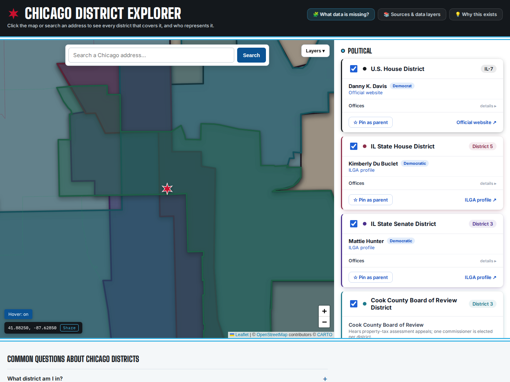

<!-- ==== GENERATED:BEGIN metro-header ==== -->
# Chicago District Explorer

**Click any point in Chicago — or search an address — and see every civic district that contains it, and who represents you there.**
<!-- ==== GENERATED:END metro-header ==== -->

A single-file, dependency-light web app: one `index.html`, Leaflet for the map, no build step, no framework, no server-side code. Deployed as a static site to [districtry.com/il/](https://districtry.com/il/) — any static host or server works.



This is the reference implementation of a fleet that now lives in ONE repo: Illinois at [`il/`](https://districtry.com/il/), New York City at [`ny/`](https://districtry.com/ny/) and San Francisco at [`ca/`](https://districtry.com/ca/), each an instance folder served from its own path. The per-metro forks are retired — the shared engine has ONE copy under `engine/` and `scripts/compose_app.py` splices it into every instance, so parity is what the layout makes true rather than what a checker asserts. Everything city-specific lives in that instance's `metro-worksheet.json` and its `METRO:BEGIN config` block. The fleet-wide layer inventory is [`docs/DATA_LAYER_GUIDEBOOK.md`](docs/DATA_LAYER_GUIDEBOOK.md).

## What it answers

Pick a point. The app runs a point-in-district lookup across every layer you have toggled on and builds a "civic profile" for that location. 39 layers ship today; layers are location-aware, so city-only layers hide outside Chicago, county-scoped layers appear only inside the counties that publish them, and the statewide layers work anywhere in Illinois.

Coverage started as the seven Chicago-metro counties and has grown to **89 counties** (as of 25 August 2026 — 77 through their own dispatch entries, 2 through a shipped judicial circuit, and 10 through the County card alone; the generated [county status table](docs/COUNTY_STATUS.md) is always current) — north to the Wisconsin line, west to the Mississippi, and south through the Metro East to the Missouri border. Growth followed county adjacency until August 2026 and now follows published data wherever it surfaces: Johnson, Perry, Union and Williamson joined on certified election returns published by a third-party results vendor with no county board page read at all, and Douglas and Vermilion shipped from a public ArcGIS Online organization that carried dozens of the county's own layers even though the county's own web map viewer only ever named one of them. No island stands today: the served area has gone disjoint four separate times as coverage grew outward from adjacency (Effingham, Hamilton, Edwards–Wabash, and finally Massac County on the Ohio River at the far south of the state), and each time a neighboring county's join reattached it to the mainland — Massac's detachment lasted part of a single day before Johnson County closed it that same evening. What the served area does carry is four holes — unserved ground entirely enclosed by served counties, confirmed by `scripts/build_metro_outline.py --check` (5 rings: one outer boundary plus these four). Two are single counties (Bureau, and Christian since Shelby's arrival enclosed it) and two are blocks sealed shut by a single county's join: Clay, Fayette, Jasper, Marion and Wayne when Richland joined, and Champaign, Ford and Piatt when Vermilion did. A hole is not permanent — Knox was one until it joined as the 80th county and its ring closed. Six consolidated layers (County Board, Judicial Subcircuit, Fire Protection District, Park District, Library District, Voting Precinct) span every county that publishes the data and pick the right county's source automatically — a judicial circuit's boundary can cover more than one county, so a county can be served through a neighbor's shipped circuit without a subcircuit layer of its own; where a county elects its board countywide instead of by district, its commissioners appear on the County card, because there is no district to draw.

Where a county publishes nothing, the app says so rather than guessing: the **Data gaps** panel lists every recorded absence — 105 as of 25 August 2026 — each naming the specific artifact its publisher would have to release.

| Group | Layer | What you get |
|---|---|---|
| **Political** | City Ward | Ward number, alderman, office phone + address |
| | Ward Precinct | Precinct number (a sub-selection of City Ward — turning it on drops the ward to an outline and fills it with its precincts) |
| | County Board District | Your county-legislature seat, dispatched across **61 counties** — Cook's Commissioner district (live officeholder join, office pin) through the collar counties to the downstate additions. Depth follows what each county publishes: members with party, phone, e-mail and profile links where a roster exists (most), name-only where it doesn't. Some counties' boards ride their own GIS; most are weekly-scraped and open a PR for human review. Where a county publishes no boundary at all, the district is DERIVED from its own published composition (whole townships or whole precincts) and the build proves the partition and population balance. Counties that elect their board **countywide** have no district and appear on the County card instead — nineteen of them (Monroe, Randolph, Pike, Brown, Calhoun, Putnam, Schuyler, Hamilton, Edwards, Greene, Morgan, Moultrie, Wabash, Massac, Saline, Gallatin, Union, Williamson, Alexander), each verified at-large from a certified election document or the county's own election authority in writing — never from a page that merely omits districts |
| | U.S. House District | District (IL-N), representative, party, D.C. phone, website |
| | IL State Senate District | Senator, party, Springfield + district offices, ILGA page |
| | IL State House District | State representative, party, offices, ILGA page |
| | Elected School Board District | ERSB district + "6b"-style sub-district, elected board member |
| | IL Supreme Court District | District under PA 102-0011 (District 1 = Cook County) |
| | Cook County Board of Review District | District under PA 102-0012 (property-tax appeals) |
| | Early Voting Site (nearest 3) | Official early-voting sites for the current cycle — site, ward, address, distance (hand-curated per election from chicagoelections.gov; each site also hosts a secured ballot drop box) |
| | Judicial Subcircuit | Your judicial subcircuit, picked by county — Cook (20, with the Circuit Court's Municipal District + courthouse), Will (12th Cir.), DuPage (18th), Lake (19th), Kane (16th), McHenry (22nd), Winnebago (17th, shared with Boone), Madison (3rd, shared with Bond), or Sangamon (7th, shared with Greene, Jersey, Macoupin, Morgan & Scott) — Kane and McHenry pre-built from the enacted PA 102-0693 shapefile; each card links its circuit's court. Bond and Jersey have no board layer of their own and are served through their circuit alone. (Kendall's 23rd Circuit has no subcircuits under the act, so the layer hides there) |
| **Public Safety** | Police District | CPD district number and name, commander, CAPS unit phone/email, station address + phone, district map link |
| | Police Beat | Beat number (a sub-selection of Police District — turning it on drops the district to an outline and fills it with its beats) |
| | CCPSA District Council | The three elected District Councilors for that police district (name + role) and links to each Councilor's profile + the council page |
| | Police Station (nearest 3) | Nearest stations anywhere in the metro (USGS National Map structures) — CPD district stations, suburban PDs, and sheriff facilities alike, with addresses |
| | Fire Station (nearest 3) | Nearest fire stations anywhere in the metro (USGS National Map structures) — CFD houses carry their district + station number; suburban entries name their department or fire protection district |
| | Fire Protection District | The fire *protection* (taxing) district serving the point, dispatched across 23 counties. Depth varies by source: trustees in Will, office contact in Lake, chief + contact in Kane, dept head + address + phone + URL in Madison, the district's own website in Peoria, and — in Iroquois — the county's own note recording where its two sources disagree. Name-only elsewhere. Response-zone layers are deliberately excluded: a dispatch zone is not a taxing district |
| | DuPage Special Police District | Township police-tax district funding supplemental DuPage County Sheriff patrol of unincorporated areas, with the Sheriff linked |
| **Schools** | Elementary / Middle / High School Zone | CPS attendance-boundary school, grades, address, profile link, map pin |
| | CPS Network (K-8 / High School) | Network, chief, phone, office address |
| | School District (Unified / Elementary / High School) | Statewide TIGERweb school-district identity — which district a point belongs to anywhere in Illinois |
| | School Location (nearest 3) | Nearest schools — name, grades, type, address, distance |
| **Geography** | Community Area | Official community area name + number |
| | ZIP Code | ZIP code (live Census TIGERweb ZCTA — works statewide) |
| | County | County name + seal, anywhere in Illinois |
| | Township / County Subdivision | Township (a sub-selection of County) |
| | Municipality | Incorporated place name, anywhere in Illinois |
| | Park District | Park district, dispatched across 14 counties — a Chicago click resolves the Chicago Park District. Commissioners in Will, office contact in Lake, board president + contact in Kane, the district's own website in Peoria, name-only elsewhere. Counties that publish park *facilities* rather than district boundaries (McHenry) are recorded gaps, not guesses |
| | Library District | Which separate library taxing body serves the point, dispatched across 16 counties — Cook distinguishes independent Public Library Districts from municipal Library Funds (a Chicago click resolves the City of Chicago Library Fund). Trustees in Will, office contact in Lake, board president + contact in Kane, the district's own website in Peoria, name-only elsewhere |
| | Voting Precinct | County voting precinct (a sub-selection of Township), dispatched across 69 counties, with the containing County Board district and the county clerk's election lookup. Most counties' cards also name the polling place where the county publishes a precinct-keyed assignment; where it publishes only prose labels or an empty column, that's a recorded gap rather than a guess. In Chicago this layer stays hidden (city precincts are the Ward Precinct layer), as it does inside Rockford, which runs its own election commission |
| | TIF District | Which Cook tax-increment-financing district contains the point (the Clerk's current agency tiling) with the Clerk agency number and a link to the Clerk's TIF revenue reports — most points are in no TIF, and that honestly shows as no result |
| | Water Reclamation District (MWRD) | Whether the point lies inside the Metropolitan Water Reclamation District of Greater Chicago (one district, nine commissioners elected at large — the card links the official board); Cook's fringe townships sit outside |
| | Post Office (nearest 3) | Post office name, address, distance (USGS National Map structures) |
| | Library (nearest 3) | Chicago Public Library location, address, phone, distance |

Every result card is independent: a layer whose data source is down shows an error with a Retry button in that card and never affects the others.

### Shareable links

The URL hash mirrors your current view (`#point=41.88250,-87.62850&layers=ward,school-board`). Copy it from the URL bar — or use the **Copy link** button on the selected-point chip — and anyone opening the link sees the same point with the same layers on.

## Running it

There is nothing to build.

```bash
# any static server works:
python3 -m http.server 8000
# then open http://localhost:8000/
```

Cook and the collar counties mostly fetch live data from public APIs at runtime, so they need an internet connection. Most of the downstate counties publish no live API at all — no GIS, sometimes no county website a machine can read — so their boundaries are pre-built once (often derived from Census voting districts, election canvasses, or a county's own GIS export) and shipped as same-origin files under `il/data/app/`, fetched on first toggle. That directory holds 271 files today: 194 boundary/geometry files, served cache-first by the service worker (`il/sw.js`) since boundaries change roughly once a decade, so once a layer has loaded it keeps working offline; and 77 officeholder-roster files, served network-first so a returning visitor always gets the latest roster rather than a stale one. `docs/COUNTY_STATUS.md` and [`il/sources.html`](https://districtry.com/il/sources.html) name what backs each county's layers.

## Architecture

Stable core + pluggable layer modules, all inside `index.html`. The full contract and build history live in [`docs/BUILD_PLAYBOOK_1.md`](docs/BUILD_PLAYBOOK_1.md); the primary deployment guide for all future expansion (new counties, statewide growth, new metro forks, new concepts) is [`docs/EXPANSION_GUIDE.md`](docs/EXPANSION_GUIDE.md).

- **Core**: Leaflet map, click-to-select + Photon/Nominatim geocoder (debounced, Chicago-bounded), global `{selectedPoint, sequence}` state where a monotonic sequence counter discards stale async results, shared `sanitize` / `pointInGeometry` / `fetchJSONWithRetry` utilities, layer registry + result-card framework with per-layer failure isolation, selected-boundary highlight, URL-hash permalinks.
- **Modules**: each layer registers `{id, group, label, overlay:{load, style}, query(point, seq), render(result)}`. Overlays lazy-load on first toggle and are cached; `query` runs a local point-in-polygon test against the cached boundaries (or nearest-N haversine for station/school/amenity layers). Layers can declare a `coverage(point)` test — outside their coverage they hide instead of erroring. The six cross-county concepts (County Board, Judicial Subcircuit, Fire Protection District, Park District, Library District, Voting Precinct) register through one `registerCountyLayer` dispatcher each — a single toggle holding a per-county entry table, whose combined coverage is the OR of its counties' tests — so adding a county to a shipped concept is a dispatch-table entry, not a new layer.
- **Result cards**: cards open with the layer name, then the district identifier, then — wherever a verifiable source exists — the officeholder(s), office location, contact info, and a link to more detail, in that order. Layers whose concept has no representative (a ZIP, a community area) omit the roster rows rather than padding them.
- **Honesty rules**: external strings are sanitized or rendered via `textContent`; officeholder data is never guessed — where no verifiable roster source exists, cards link to the official body instead.

### Data sources

The reader-facing version of this is **[districtry.com/il/sources.html](https://districtry.com/il/sources.html)** (`il/sources.html`): the same credits, plus a **layer matrix** giving each of the app's layers its own row — what it answers, the publisher its boundary comes from, where the names on its card come from, and the ground it answers on. It is generated from `metro-worksheet.json`'s `layers[].source`, off the same list that drives the layer registry, so it cannot fall behind the app. The table below stays as the maintainer's summary, grouped by publisher rather than by layer — it covers the Chicago-metro sources; the several dozen downstate county GIS hosts, results platforms, and county-run scrapers behind the rest of the fleet are cataloged per-county in `docs/COUNTY_STATUS.md` and per-layer on the sources page above, not enumerated here.

Downstate, three commercial election-results platforms carry certified canvasses for dozens of Illinois counties each and back a meaningful share of the fleet's boards and precincts where no county GIS exists: `il-<county>.pollresults.net` / `.accessliberty.com`, `platinumelectionresults.com`, and `results.gbsvote.com` / `results.enr.clarityelections.com`. A county's own certified canvass — not the vendor — is always the cited source; the platform is only the delivery mechanism.

| Source | Used for |
|---|---|
| [Chicago Data Portal](https://data.cityofchicago.org) (Socrata) | Wards + aldermen roster, ward precincts, library locations, CPS zones + networks, community areas |
| CPD ArcGIS (`services2.arcgis.com/t3tlzCPfmaQzSWAk`) | Police district boundaries, police beat boundaries, police station roster, school locations |
| [chicagopolice.org](https://www.chicagopolice.org) per-district pages (scraped weekly by CI) | Police district commander, CAPS unit phone/email, station address (`il/data/app/cpd-district-info.json`) |
| [ccpsa.chicago.gov](https://ccpsa.chicago.gov) per-council pages (scraped weekly by CI) | CCPSA District Council elected Councilors — name + role per police district (`il/data/app/ccpsa-district-councils.json`); boundaries reuse the CPD police-district geometry |
| Cook County GIS (`gis.cookcountyil.gov/traditional/rest/services`) | Cook County Commissioner district boundaries + live officeholder table (the County Board layer's Cook entry); the Clerk's library, fire-protection, and park tax-agency tilings (the Library / Fire Protection / Park District layers' Cook entries); the Clerk's current suburban voting precincts (`precinctHistorical` L0, the Voting Precinct layer's Cook entry); the Clerk's current TIF tiling (`clerkTaxDistricts` L18) and the MWRD boundary (`politicalBoundary` L21) |
| [U.S. Census TIGERweb](https://tigerweb.geo.census.gov) | Live statewide layers (County, Township, Municipality, the three School District layers, ZIP/ZCTA) plus the pre-built U.S. House / IL Senate / IL House boundaries (`il/data/app/*-districts.json`) |
| Will County ArcGIS | Judicial subcircuits, Board districts, fire protection districts, park districts, library districts, voting precincts |
| DuPage County ArcGIS (`services.arcgis.com/neJvtQ4PXvnQ86MJ`) | Judicial subcircuits, Board districts, fire protection districts, special police districts, park districts, library districts, voting precincts |
| Lake County ArcGIS (`services3.arcgis.com/HESxeTbDliKKvec2`) | Judicial subcircuits, Board districts (incl. member + contact), fire protection districts, park districts, library districts, voting precincts |
| [lakecountyil.gov](https://www.lakecountyil.gov/2336/Board-Members) (scraped weekly by CI, Internet Archive fallback) | Lake County Board leadership tags — Chair/Vice-Chair (`il/data/app/lake-county-board-roles.json`) |
| Kane County ArcGIS (`services1.arcgis.com/oRKmdBXD6EbdmVgJ`, the `KaneCo_IL_*` family) | Board districts (incl. member names), fire/park/library districts (incl. officer + office contact), voting precincts |
| McHenry County ArcGIS (`services1.arcgis.com/6iYC5AXXYapRVNzl`) | Board districts (district numbers only), fire/library districts, voting precincts |
| Kendall County ArcGIS Enterprise (`maps.co.kendall.il.us/server`) | Board districts, fire/park/library tax-code tilings, voting precincts + polling places, townships |
| [willcountyillinois.gov](https://willcountyillinois.gov) (scraped weekly by CI) | Will County Board member roster (`il/data/app/will-county-board-members.json`) |
| [kanecountyil.gov](https://www2.kanecountyil.gov/pages/countyboard/boardMembers.aspx) SharePoint list API (scraped weekly by CI) | Kane County Board member roster incl. party, office phones, emails, and the countywide Chair (`il/data/app/kane-county-board-members.json`) |
| [kendallcountyil.gov](https://www.kendallcountyil.gov/county-board/board-members) (hand-verified; weekly CI refresh attempts — the county blocks automated fetch) | Kendall County Board member roster (`il/data/app/kendall-county-board-members.json`) |
| [mchenrycountyil.gov](https://www.mchenrycountyil.gov/departments/county-board/meet-your-county-board-members) (hand-verified; weekly CI refresh attempts — the county blocks automated fetch) | McHenry County Board member roster incl. the countywide Chairman (`il/data/app/mchenry-county-board-members.json`) |
| [dupagecounty.gov](https://www.dupagecounty.gov) (scraped weekly by CI) | DuPage County Board member roster + countywide Chair (`il/data/app/dupage-county-board-members.json`) |
| [unitedstates/congress-legislators](https://github.com/unitedstates/congress-legislators) (rebuilt weekly by CI) | U.S. House roster — IL's 17 reps only, `il/data/app/congress-roster.json` |
| [ilga.gov](https://www.ilga.gov) (scraped weekly by CI) | IL Senate/House member rosters (`il/data/app/il-{senate,house}-members.json`) |
| ERSB shapefile (`ERSB_20_Sub_District_Map_FA1_SB_15`) | Elected School Board sub-districts (`il/data/app/school-board-*.json`) |
| PA 102-0011 / PA 102-0012 shapefiles | IL Supreme Court + Cook County Board of Review districts (`il/data/app/*.json`) |
| [USGS The National Map](https://www.usgs.gov/programs/national-geospatial-program/national-map) structures layers 38 / 51 / 53 | Post office, fire station, and police station locations, metro-wide (live bbox queries; public domain) |
| [chicagoelections.gov](https://chicagoelections.gov) (hand-transcribed per election) | Early-voting sites (`il/data/app/early-voting-sites.json`) — no open point dataset exists, so the official list is curated by hand each election |
| [Nominatim / Photon / OpenStreetMap](https://www.openstreetmap.org/copyright) | Address search + school-address pins |

The app-data boundary layers in `il/data/app/` are topology-preserving simplifications (mapshaper) of the official shapefiles; the full-precision GeoJSON conversions are kept in `il/data/` and the untouched originals in `il/data/source/raw/`. The simplified copies agreed with full precision on 100% of 2,000 random in-city test points.

## Repository layout

The fleet lives in one repo. Each metro is a self-contained instance folder — its own app, service worker, data, sub-pages, `README.md`, `CLAUDE.md`, `docs/` and `scripts/` — and the repo root holds only what genuinely is fleet-wide: the shared engine, the manifest that lists the metros, and a handful of pages published at the bare domain.

```
index.html · sw.js                  the FLEET LANDING PAGE (GENERATED from metros.json) and its
                                    service-worker kill switch — not the app; see il/ below
county-board.html, police-district.html,
school-board.html                   thin redirect stubs for old chidistricts.com URLs, forwarding
                                    to their il/ equivalent (search-equity holdovers, not live pages)
privacy.html                        ONE privacy page for every instance (GENERATED, measures each
                                    app's shipped index.html rather than trusting a worksheet)
metros.json                         the fleet manifest — one entry per metro (id, url, landing blurb);
                                    editing this and regenerating is how a new metro is added
engine/                             the ONE shared copy of the metro-agnostic engine (fenced blocks +
                                    sub-page shell), spliced into every instance by compose_app.py
scripts/                            fleet-wide builders/gates (compose_app.py, generate_metro_files.py,
                                    build_landing_page.py, build_privacy_page.py, build_county_status.py,
                                    fleet_status.py, and the shared IL data-pipeline scripts — see il/scripts/)
docs/                               the expansion guide, fleet layer guidebook, dev-process log, archives
schema/metro-worksheet.schema.json  validates every instance's metro-worksheet.json before it's used
districtry/                         brand source: design canvases, tokens (districtry.tokens.css), icons
fonts/                              the landing page's own self-hosted Barlow (distinct from il/fonts/)
WATCH.md                            the redistricting watch calendar (when to look; the runbook is what to do)
CNAME · sitemap.xml · robots.txt    districtry.com, GitHub Pages custom domain + SEO plumbing

il/                                 ILLINOIS — the reference implementation (this README covers it)
  index.html                        the entire app: styles, core, all layer modules — composed from
                                    engine/ plus this instance's own METRO config and layer modules
  sw.js                             service worker (cache-first geometry, network-first rosters)
  metro-worksheet.json              this instance's per-fork facts; regenerates its GENERATED regions
  sources.html, faq.html, county-board.html,
  police-district.html, school-board.html   sub-pages — composed the same way as index.html
  data/app/                         271 files the page fetches: boundary geometry (cache-first) +
                                    officeholder rosters (network-first)
  data/ · data/source/raw/          full-precision conversions and untouched originals
  scripts/                          IL-specific scrapers/builders — one scraper+builder pair per roster
                                    (ilga_scraper.py, build_congress_roster.py, cpd_district_scraper.py,
                                    the ~80 county-board/precinct/fire/park/library builders, etc.),
                                    plus this instance's own validate_index.py and smoke_test.mjs
  docs/                             COUNTY_STATUS.md (generated per-county completion table),
                                    DATA_LAYER_GUIDEBOOK.md (fleet layer inventory), EXPANSION_GUIDE.md
                                    (the primary deployment guide for new counties/concepts), BUILD_PLAYBOOK_1.md

ny/                                 NEW YORK CITY — same shape as il/, imported from the retired NYC fork
ca/                                 SAN FRANCISCO — same shape as il/, imported from the retired SF fork

.github/workflows/                  weekly roster refreshes (PR for human review, never auto-committed),
                                    the per-PR smoke-test.yml (all the gates below), monthly
                                    validate-sources, weekly fleet-status, Pages deploy
```

## Validation

`smoke-test.yml` runs on every pull request and covers every instance, not just Illinois. Roughly in order:

- **Composition and generation drift gates** (all stdlib-only Python, run before anything is installed): `generate_metro_files.py --check` (every `GENERATED:BEGIN/END` region — in `index.html`, `sw.js`, `sources.html`, `README.md`, `CLAUDE.md`, and more — matches what `metro-worksheet.json` renders); `compose_app.py --check` (every instance's `index.html`/`sw.js`/sub-pages carry the shared `engine/` blocks byte-for-byte, with no fence hand-edited in place); `build_brand_tokens.py --check` (the brand palette has one source, `districtry/tokens/districtry.tokens.css`); `build_coverage_gaps.py --check`, `build_county_status.py --check`, `build_dark_map_palette.py --check`, `build_landing_page.py --check`, `build_privacy_page.py --check` (this one *measures* each shipped app rather than trusting a manifest — it regexes each `index.html` for what it actually does), and `build_manifests.py --check` (the installable web-app manifest matches the brand keys and points at an icon that actually exists).
- **Static merge gate** (`scripts/validate_index.py`, run once per instance — `il/`, `ny/`, `ca/`): each instance's inline script passes `node --check`, every layer id it declares is still registered (39 for Illinois today), no dataset is embedded inline, every `data/app/*.json` file is present and shape-checked, and the sources page covers every registered layer and is linked from the app.
- **Other stdlib gates**: `validate_shell_continuations.py` (a `#` comment inside a backslash-continued shell line silently truncates the command — caught a real deploy outage), `validate_workflow_deps.py` (every script a workflow runs imports only under what that workflow actually installs), `backfill_board_seats.py --check` (a roster whose scraper is blocked still carries an honest seat count), and `check_roster_retention.py --base <PR base SHA>` (compares every roster field against the same file at the PR's base and fails when a field — like a whole county's e-mail column going silently empty — stops being published; this is why the checkout uses `fetch-depth: 0`).
- **Behaviour gate** (`scripts/smoke_test.mjs`, once per instance, served together from one local static server): a real Chromium boot via Playwright asserts each app comes up, registers all its layers, classifies a known point against known ground truth (Illinois: school board 12, IL Supreme Court 1, Board of Review 3, including the school-board member-roster join), and degrades to an isolated error card + Retry when a data source fails. Alongside it, `landing_test.mjs` asserts the root fleet landing page and its old-URL forwarding both work in a real browser, and `page_consistency_test.mjs` checks every page in `sitemap.xml` carries the same brand and standing links.
- **Monthly / weekly, not per-PR**: `validate_sources.py` (upstream dataset ids still resolve; a newer-year Socrata edition is flagged) and `validate_card_links.py` (every URL a card or roster actually renders still resolves), folded into one tracking issue on WARN/FAIL rather than editing anything; the weekly `fleet_status.py` run, which diffs every instance's layer roster and gaps file against `docs/DATA_LAYER_GUIDEBOOK.md`.

## Not for legal or official use

Boundary and roster data come from public sources that explicitly disclaim legal precision. Always confirm district assignments and officeholders with the relevant government office before relying on them for anything official.
